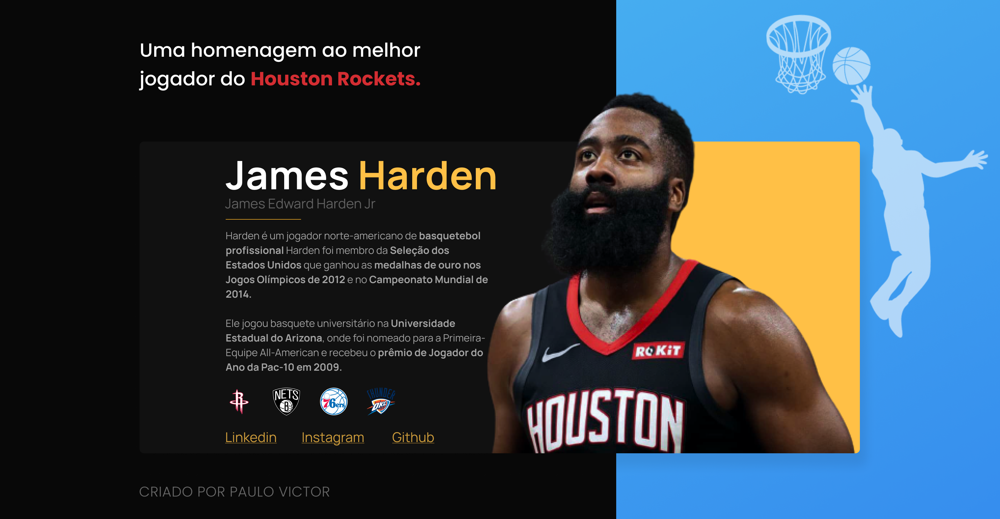

# Tributo ao James "Edward" Harden

 
 

 

<a target="_blank" src="https://www.linkedin.com/in/paulopbi/">Linkedin</a> -
<a target="_blank" src="https://github.com/Paulpbi">Github</a> -
<a target="_blank" src="https://www.instagram.com/paulopbi_/">Instagram</a>

 

Esse projeto é uma landing page de "tributo" ao meu jogador de basquete preferido da NBA mostrando um pouco de sua historia. 🏀

### Design:

- A landing page foi feita no figma, a foto recortada no photoshop.

### Código:

- A primeira sessão, é onde está o conteúdo (titulo, texto, foto dos times e os links das minhas redes sociais).
- A segunda sessão (em amarelo) é onde está a foto do jogador dentro de uma DIV e a foto como background-image.

### O que eu aprendi:

- Figma
- Photoshop
- Html
- Css
- Flexbox
- Responsividade
  

OBRIGADO POR VER MEU PROJETO

